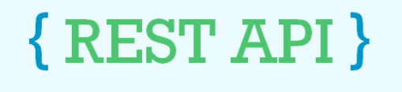

<br>This is RESTful API project which lets the user to GET/POST/PATCH/DELETE. i use Node.js as a backend language, express.js for routes, Mongoose for create schemas, and MongoDB for Storing Data.
## Install
To create a package.json files
```
$ npm init
```
install express.js
```
$ npm install express
```
install nodemon (nodemon is a tool that helps develop node. js based applications by automatically restarting the node application when file changes in the directory are detected.)
```
$ npm install nodemon
```
